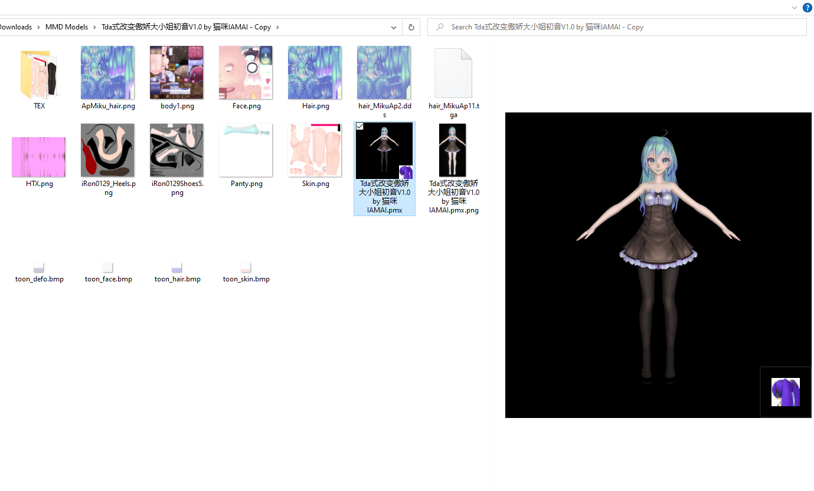

# PMX Windows Shell Extensions
 A shell extension for handling mmd thumbnail

 Just as the image shows, pmx file will have a preview image

 For now, this extension only test with few scenarios so that may not be stable, and also, not looking great as I'am using a HelixToolkit.Wpf library.

 ## TODO:
 - Canmera position
 - Shading
 - Exception Handle

