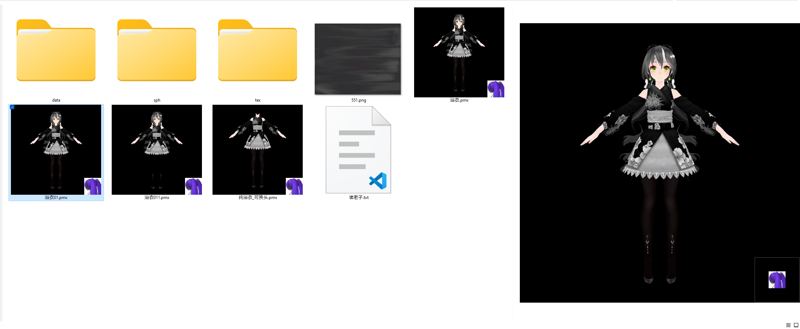

# PMX Windows Shell Extensions
A shell extension for handling mmd thumbnail

Just as the image shows, pmx file will have a preview image
 
# 2022.5 Update

Rewrite with sharpDX, a toon style shading basically match MikuMikuDance.

# How to install

Please download from release tab and find the newest version, extract somewhere you like, open the folder you extracted, there are two `.bat` file for install and uninstall.
Notes that any of these two operation will restart windows explorer.

# Current problems
- `.tga` files not released after generating preview, you have to restart windows explorer.
- VRAM not released after generation previews, also you have to restart windows explorer to release VRAM. Also for RAM.
- Reading textures may filp R and B channel, you may get a "Avatar" image, most `.png` and `.jpg` textures are fine.

